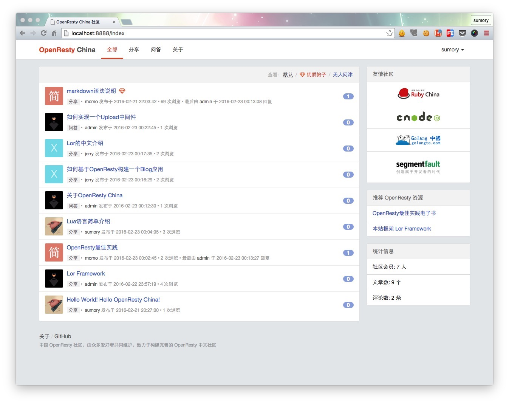

# OpenResty China 

一个运行在[OpenResty](http://openresty.org)上的基于[lor](https://github.com/sumory/lor)编写的社区软件。

- 主要页面直接采用了[ruby-china](https://github.com/ruby-china/ruby-china)的样式
- 完全基于OpenResty，是入门OpenResty Web开发的良好范例
- 基于[Lor Framework](https://github.com/sumory/lor)，轻松简单的开发Sinatra风格的web应用
- 存储采用MySQL，文件本地落地存储

### 安装

- 首先安装OpenResty、luajit和[lor](https://github.com/sumory/lor)框架，安装成功的标志是以下三个命令可以正常输出
	- nginx -v
	- luajit -v
	- lord -v
- 将仓库中提供的[sql文件](install/blog.sql)导入到MySQL
- 修改配置文件`app/config/config.lua`为本地对应配置，强烈建议将以下值修改为不同配置
	- session_secret 用于session加密
	- pwd_secret 用户数据库密码存储时加密
- 配置静态文件目录，这个目录用于存放用户上传的头像、文章图片、评论图片等
	- 默认的目录为/data/openresty-china/static，请在本地新建此目录，并保证该目录有供应用访问和修改的权限
	- 若要修改上述默认目录，请修改app/config/config.lua中的upload_config.dir和nginx配置文件中的$static_files_path的值，保证两个值一致
	- 在设置好静态文件目录后，将install/avatar下的所有文件拷贝到该目录，如 cp install/avatar/* /data/openresty-china/static/
- 执行`sh start.sh`即可使用conf/nginx-dev.conf启动开发环境，也可使用`sh start.sh prod`启动生产环境。若要用于生产，强烈建议用户检查并更改app/config/config.lua和conf/nginx-prod.conf为本地合适的配置
- 访问`http://localhost:8888`即可体验openresty china功能
- 有几个初始账户供体验: admin/sumory/momo/jerry，密码均为123456

### 讨论交流

目前有一个QQ群用于在线讨论： 522410959

### License

[MIT](./LICENSE)